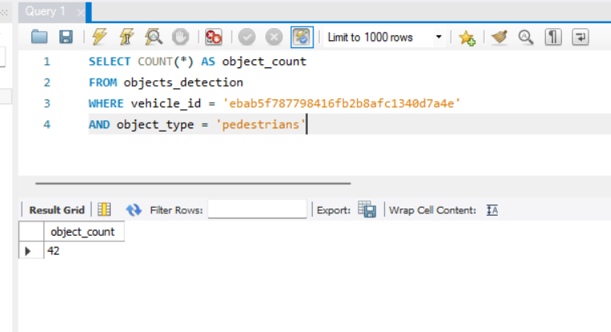
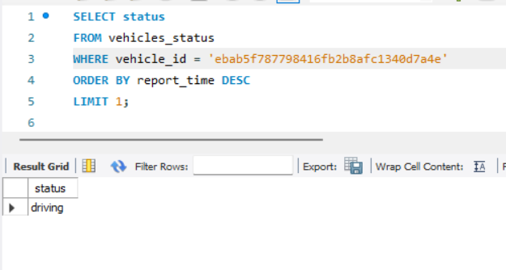
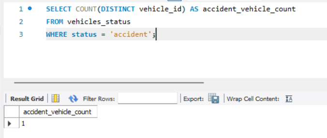
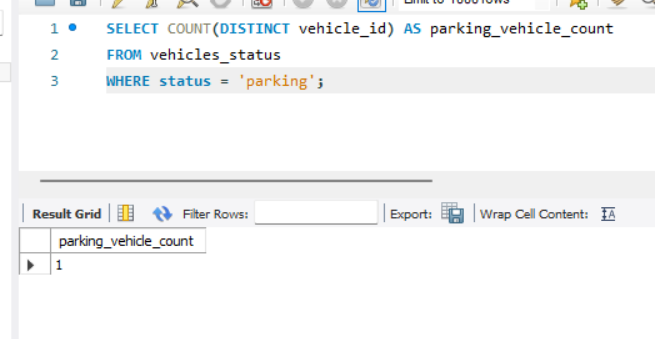
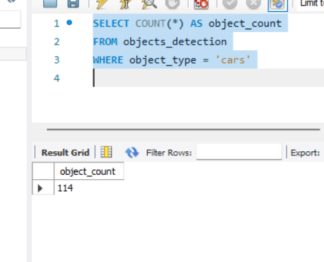
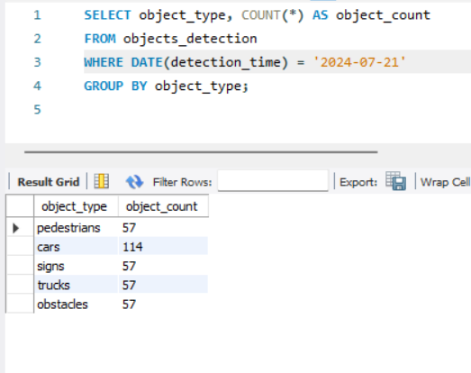
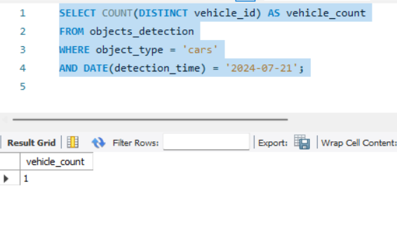

# Vehicle and Object Detection Data Processing

This project monitors a directory for new JSON files containing vehicle status and object detection events from Mobileye's cars. The data is loaded into a database for further analysis.

## Project Overview

This project includes:
1. A file watcher that detects new JSON files in a directory.
2. Processes the JSON files and loads the data into a PostgreSQL database.
3. Provides SQL queries to analyze the data.

Unfortunately - used mysql and not postgresql just because of installestion issues withing the time.

But I would choose postgresql over mongo - as 
## Database Configuration

### Tables

- **objects_detection**
  - `vehicle_id`: UUID of the vehicle
  - `detection_time`: Timestamp of the detection event
  - `object_type`: Type of the detected object (e.g., pedestrian, car)
  - `object_value`: Value associated with the detected object (e.g., count)

- **vehicles_status**
  - `vehicle_id`: UUID of the vehicle
  - `report_time`: Timestamp of the status report
  - `status`: Current status of the vehicle (e.g., driving, parked, accident)

### SQL to Create Tables

```sql
CREATE TABLE objects_detection (
    id SERIAL PRIMARY KEY,
    vehicle_id UUID NOT NULL,
    detection_time TIMESTAMP NOT NULL,
    object_type VARCHAR(50) NOT NULL,
    object_value INTEGER NOT NULL
);

CREATE TABLE vehicles_status (
    id SERIAL PRIMARY KEY,
    vehicle_id UUID NOT NULL,
    report_time TIMESTAMP NOT NULL,
    status VARCHAR(50) NOT NULL
);
```

## File Processing
The project monitors the data directory for new files with the following naming conventions:

objects_detection: objects_detection_[timestamp].json
vehicles_status: vehicles_status_[timestamp].json
When a new file is detected, it is processed and the data is inserted into the respective database tables.

### Common Queries

#### 1. How many objects of a specific type were detected by a specific vehicle in a given time range?
Example query:
To count the number of 'pedestrians' detected by the vehicle with ID 'ebab5f787798416fb2b8afc1340d7a4e' between '2022-06-05T21:00:00Z' and '2022-06-05T22:00:00Z', use the following query:
```sql
SELECT COUNT(*) AS object_count
FROM objects_detection
WHERE vehicle_id = 'ebab5f787798416fb2b8afc1340d7a4e'
AND object_type = 'pedestrians'
AND detection_time BETWEEN '2022-06-05T21:00:00Z' AND '2022-06-05T22:00:00Z';
```


#### 2. What is the latest status of a specific vehicle?
Example query:
To get the latest status of the vehicle with ID 'ebab5f787798416fb2b8afc1340d7a4e', use the following query:
```sql
SELECT status
FROM vehicles_status
WHERE vehicle_id = 'ebab5f787798416fb2b8afc1340d7a4e'
ORDER BY report_time DESC
LIMIT 1;
```


#### 3.  How many vehicles are currently in "accident" status?
Example query:
To count the number of vehicles that are currently in "accident" status, use the following query:
```sql
SELECT COUNT(DISTINCT vehicle_id) AS accident_vehicle_count
FROM vehicles_status
WHERE status = 'accident';
```


#### 4. How many vehicles are in "parking" status at any given time?
Example query:
To count the number of vehicles that are in "parking" status at any given time, use the following query:
```sql
SELECT COUNT(DISTINCT vehicle_id) AS parking_vehicle_count
FROM vehicles_status
WHERE status = 'parking';
```


#### 5. How many objects of a specific type were detected by all vehicles in a given time range?
Example query:
To count the number of 'cars' detected by all vehicles between '2022-06-05T21:00:00Z' and '2022-06-05T22:00:00Z', use the following query:
```sql
SELECT COUNT(*) AS object_count
FROM objects_detection
WHERE object_type = 'cars'
AND detection_time BETWEEN '2022-06-05T21:00:00Z' AND '2022-06-05T22:00:00Z';
```

#### 6. What is the distribution of object types detected by all vehicles on a specific day?
Example query:
To get the distribution of object types detected by all vehicles on '2022-06-05', use the following query:
```sql
SELECT object_type, COUNT(*) AS object_count
FROM objects_detection
WHERE DATE(detection_time) = 'specific_date'
GROUP BY object_type;
```


#### 7. How many vehicles reported detecting objects of a specific type on a given day?
```sql
SELECT COUNT(DISTINCT vehicle_id) AS vehicle_count
WHERE object_type = 'specific_object_type'
AND DATE(detection_time) = 'specific_date';
```


### Performance Considerations
#### CPU and Execution Time
- *efficiency*: The current implementation using the watchdog library for file monitoring is efficient, consuming minimal CPU and memory resources during file watching operations.
- *JSON Parsing*: The performance of JSON file processing depends on the size of the files. Larger JSON files with many records can be more CPU and memory intensive.

#### Potential Bottlenecks
- *Bulk Inserts*: When processing large JSON files, bulk inserts into the database can be a bottleneck. To improve performance, consider using batch inserts or optimizing the database schema.
- *Streaming JSON Parsing* Implement streaming JSON parsing to handle large files more efficiently, reducing memory usage.
- *Multi-threading*: i didn't use multithreading for now - but of course this can be an important thing